# Calculadora Simple 

Trabajo Práctico Nro. 1 de Programación web Front-end dictado por la FAMAF (UNC) - Argentina Programa 4.0.

## Objetivo 

_Crear una calculadora simple utilizando HTML5, CSS3 y JavaScript que permita a los usuarios realizar operaciones básicas de suma, resta, multiplicación y división._

## Características 

- Realiza operaciones de suma, resta, multiplicación, división y promedio.
- Interfaz de usuario intuitiva y fácil de usar.
- Manejo básico de errores en caso de divisiones entre cero u otros problemas como números muy grandes o muy pequeños así como también los NaN.

## Cómo Usar 

1. Clona este repositorio en tu máquina local.
2. Abre el archivo `index.html` en tu navegador web.
3. Utiliza los botones y campos de la calculadora para introducir números y operaciones.
4. El resultado de la operación se mostrará en pantalla.


### Pre-requisitos 

Antes de comenzar, asegúrate de tener lo siguiente: 

- **Navegador Web:** Asegúrate de tener instalado un navegador web actualizado, como Google Chrome, Mozilla Firefox, Safari, o Microsoft Edge. 

- **Conexión a Internet:** Para acceder a los recursos externos.

- **WinZip:** Para poder descomprimir el archivo. Para ello, dirígete al siguiente enlace:

    + [WinZip](https://www.winzip.com/es/download/winzip//) - _Descarga el programa que permite comprimir y descomprimir archivos._

    + _Una vez en el sitio, presiona en el botón que muestra la imagen a continuación para poder descargarlo._

        

- **Editor de código:** Si lo que deseas es ver o modificar el código con el que fue desarrollado, deberás descargar un editor de código como Visual Studio Code, Atom, Notepad++, entre otros. Te dejo aquí debajo el que yo utilicé para descargarlo.

    + [VSCode](https://code.visualstudio.com/) - Editor de código fuente.

    + _Ingresa al enlace y cliclea en el botón descargar si tienes Windows, sino, puedes dar click en la flecha desplegable y elegir el sistema operativo que poseas en tu pc._

        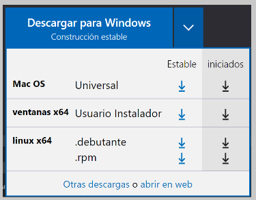


### Instalación 

Sigue estos pasos para obtener y ejecutar la calculadora en tu máquina: 

1. **Clonar el Repositorio:** Abre tu terminal y navega a la ubicación donde deseas almacenar la calculadora. Luego, ejecuta el siguiente comando para clonar el repositorio:

```
git clone https://github.com/Magui2608/sobre-mi/tree/main/Tp1-Calculadora-Simple
```
2. **Descargar como Archivo ZIP:** Si prefiere descargar el repositorio como un archivo ZIP en lugar de clonarlo usando Git, sigue estos pasos: 

    + _Ve a la página principal del repositorio en GitHub:_ [https://github.com/Magui2608/sobre-mi](https://github.com/Magui2608/sobre-mi)

    + _Haz clic en "tag", busca el archivo practico1 y haz clic en zip para descargarlo._
        >Imágenes de referencia
        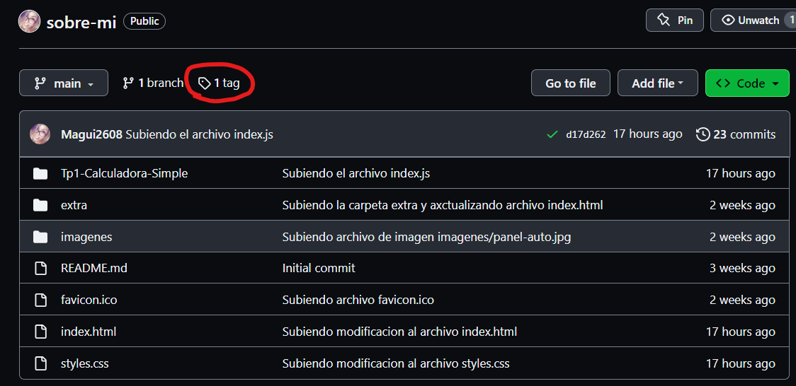
        
        >Imágenes de referencia
        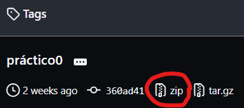
        

    + _Una vez descargado, deberás abrirlo haciendo doble clic sobre él y este se abrirá con el programa WinZip para que lo puedas descomprimir dentro de la carpeta de tu preferencia._


## Ejecutando las pruebas 

_Si deseas realizar pruebas en la calculadora, sigue estos pasos:_

###Paso 1: 
Asegúrese de tener el repositorio clonado o descargado en su máquina local. Si aún no lo ha hecho, siga las instrucciones de la sección de instalación.

###Paso 2: 
Abre el archivo `index.html` en tu navegador web para cargar la calculadora. Aquí tienes los pasos para hacerlo:

- Abre el Explorador de Archivos en tu pc.
- Navega a la carpeta donde clonaste el repositorio o descomprimiste el archivo ZIP.
- Busca y haz doble clic en el archivo llamado `index.html`. Esto abre el archivo en tu navegador predeterminado.

###Paso 3: 
Una vez que la calculadora se carga en su navegador, realice las siguientes operaciones para verificar su funcionamiento:

- Ingresa números en los campos de entrada `Operando 1` y `Operando 2`.
- Haz clic en el menú desplegable para seleccionar la operación que deseas realizar (+, -, *, /, promedio).
- Haz clic en `Calcular` y el resultado se mostrará en pantalla.
- Para borrar los campos, haz clic en `Limpiar campos`.

###Paso 4: 
Prueba situaciones especiales para verificar cómo maneja la calculadora estos casos:

- Intenta dividir entre cero y observa si la calculadora muestra un mensaje de error.
- Ingresa valores no numéricos (por ejemplo, letras) en los campos de entrada y verifica si la calculadora muestra un mensaje de error.
- Intenta ingresar valores muy pequeños o muy grandes, o trata de ver si genera resultados con números muy pequeños o muy grandes.

### Analice las pruebas end-to-end 

_Estas pruebas verifican que la calculadora pueda realizar operaciones básicas correctamente y que los resultados sean los esperados. También confirma que los botones y la interfaz de usuario funcionan como se espera._

1. **Prueba de Suma con enteros**

```
1. Ingreso el operando 1 como "5".
2. Selecciono la operación de suma "+" en el menú desplegable.
3. Ingreso el operando 2 como "3".
4. Hago clic en el botón "Calcular".
5. Verifico que la interfaz muestre el mensaje "El resultado es: 8", que es el resultado correcto de la suma de 5 y 3.
```
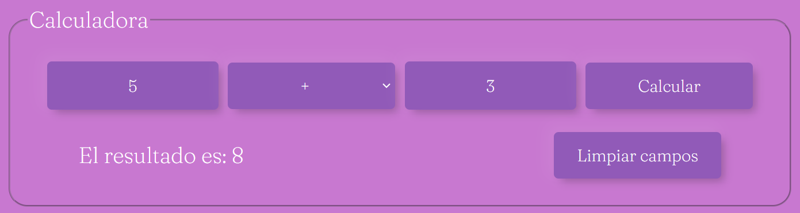


2. **Prueba de Suma con decimales**

```
1. Ingreso el operando 1 como "2.3".
2. Selecciono la operación de suma "+" en el menú desplegable.
3. Ingreso el operando 2 como "1.9".
4. Hago clic en el botón "Calcular".
5. Verifico que la interfaz muestre el mensaje "El resultado es: 4.2", que es el resultado correcto de la suma de 2.3 y 1.9.
```
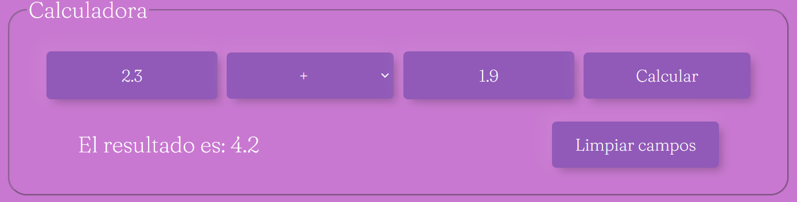

3. **Prueba de Suma con números negativos**

```
1. Ingreso el operando 1 como "-5".
2. Selecciono la operación de suma "+" en el menú desplegable.
3. Ingreso el operando 2 como "3".
4. Hago clic en el botón "Calcular".
5. Verifico que la interfaz muestre el mensaje "El resultado es: -2", que es el resultado correcto de la suma de -5 y 3.
```
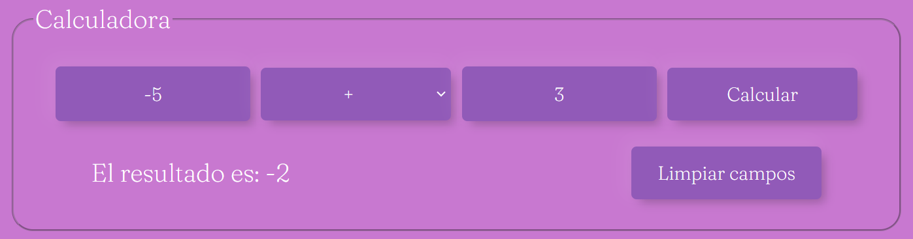

4. **Prueba de Resta con enteros**

```
1. Ingreso el operando 1 como "8".
2. Selecciono la operación de resta "-" en el menú desplegable.
3. Ingreso el operando 2 como "5".
4. Hago clic en el botón "Calcular".
5. Verifico que la interfaz muestre el mensaje "El resultado es: 3", que es el resultado correcto de la resta de 8 y 5.
```


5. **Prueba de Resta con decimales**

```
1. Ingreso el operando 1 como "6.9".
2. Selecciono la operación de resta "-" en el menú desplegable.
3. Ingreso el operando 2 como "2.5".
4. Hago clic en el botón "Calcular".
5. Verifico que la interfaz muestre el mensaje "El resultado es: 4.4", que es el resultado correcto de la resta de 6.9 y 2.5.
```
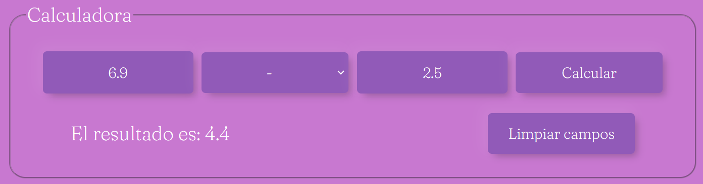

6. **Prueba de Resta con números negativos**

+ A un número positivo le restamos un número negativo:

```
1. Ingreso el operando 1 como "3".
2. Selecciono la operación de resta "-" en el menú desplegable.
3. Ingreso el operando 2 como "-4".
4. Hago clic en el botón "Calcular".
5. Verifico que la interfaz muestre el mensaje "El resultado es: 7", que es el resultado correcto de la resta de 3 y -4.
```


+ A un número negativo le restamos uno positivo:

```
1. Ingreso el operando 1 como "-3".
2. Selecciono la operación de resta "-" en el menú desplegable.
3. Ingreso el operando 2 como "4".
4. Hago clic en el botón "Calcular".
5. Verifico que la interfaz muestre el mensaje "El resultado es: -7", que es el resultado correcto de la resta de -3 y 4.
```
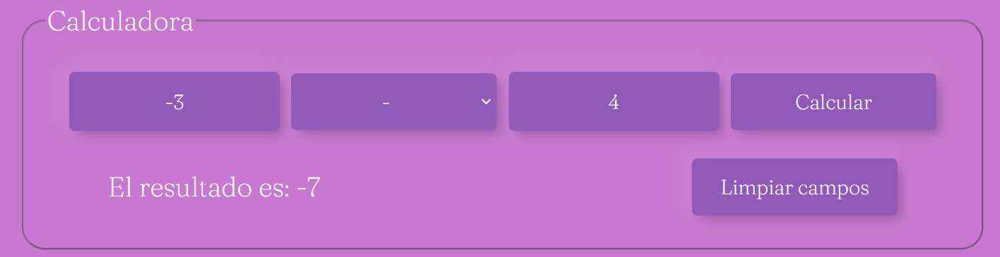

+ A un número negativo le restamos otro número negativo:

```
1. Ingreso el operando 1 como "-3".
2. Selecciono la operación de resta "-" en el menú desplegable.
3. Ingreso el operando 2 como "-4".
4. Hago clic en el botón "Calcular".
5. Verifico que la interfaz muestre el mensaje "El resultado es: 1", que es el resultado correcto de la resta de -3 y -4.
```
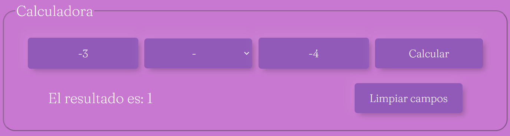

7. **Prueba de Multiplicación**

```
1. Ingreso el operando 1 como "4".
2. Selecciono la operación de multiplicación "*" en el menú desplegable.
3. Ingreso el operando 2 como "6".
4. Hago clic en el botón "Calcular".
5. Verifico que la interfaz muestre el mensaje "El resultado es: 24", que es el resultado correcto de la multiplicación de 4 y 6.
```
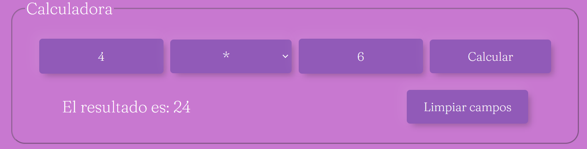

8. **Prueba de División**

```
1. Ingreso el operando 1 como "10".
2. Selecciono la operación de división "/" en el menú desplegable.
3. Ingreso el operando 2 como "2".
4. Hago clic en el botón "Calcular".
5. Verifico que la interfaz muestre el mensaje "El resultado es: 5", que es el resultado correcto de la división de 10 y 2.
```
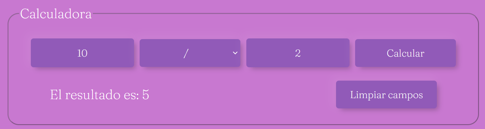

9. **Prueba de División de Decimal por Entero:**

```
1. Ingreso el operando 1 como "5.6".
2. Selecciono la operación de división "/" en el menú desplegable.
3. Ingreso el operando 2 como "2".
4. Hago clic en el botón "Calcular".
5. Verifico que la interfaz muestre el mensaje "El resultado es: 2.8", que es el resultado correcto de la división de 5.6 y 2.
```
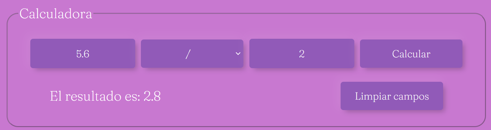

10. **Prueba de División por Cero:**

```
1. Ingreso el operando 1 como "8".
2. Selecciono la operación de división "/" en el menú desplegable.
3. Ingreso el operando 2 como "0".
4. Hago clic en el botón "Calcular".
5. Verifico que la interfaz maneje la situación de división por cero y muestre el mensaje de error apropiado.
```
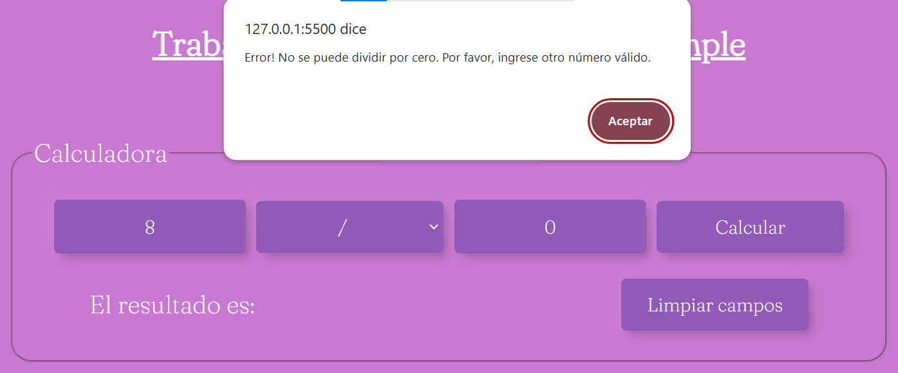


11.	**Prueba de Manejo de Valores no Numéricos:**

```
1. Ingreso el operando 1 como "abc?".
2. Selecciono la operación de suma "+" en el menú desplegable.
3. Ingreso el operando 2 como "7".
4. Hago clic en el botón "Calcular".
5. Verifico que la interfaz maneje la entrada de valores no numéricos y muestre el mensaje de error apropiado.
```


> Otro ejemplo de manejo de valores no numéricos


12. **Prueba de Límites Superiores y números grandes:**

```
1. Ingreso el operando 1 como "99999". No me deja ingresar más de 5 caracteres por el maxlength="5" aplicado al input del operando 1.
2. Selecciono la operación de multiplicación "*" en el menú desplegable.
3. Ingreso el operando 2 como "99999". Tampoco me deja ingresar más de 5 caracteres por el maxlength="5" aplicado al input del operando 2.
4. Hago clic en el botón "Calcular".
5. Verifico que la interfaz maneje la entrada de valores numéricos grandes y muestre el mensaje de error apropiado.
```

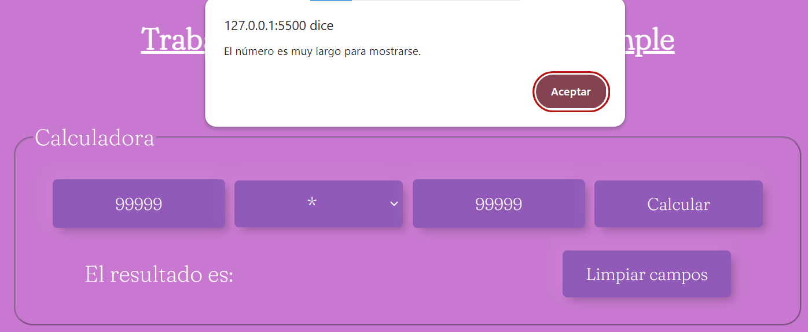


13. **Prueba de Límites Inferiores:**

```
1. Ingreso el operando 1 como "0.1". 
2. Selecciono la operación de división "/" en el menú desplegable.
3. Ingreso el operando 2 como "10". 
4. Hago clic en el botón "Calcular".
5. Verifico que la interfaz muestre el mensaje "El resultado es: 0.01", que es el resultado correcto de la división de 0.1 y 10.
```
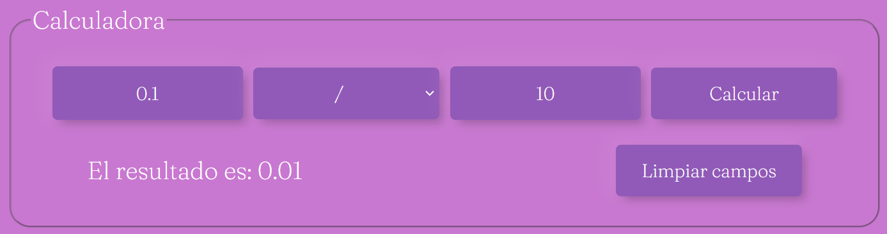

14. **Prueba de Promedio:**

```
1. Ingreso el operando 1 como "12". 
2. Selecciono la operación de promedio "promedio" en el menú desplegable.
3. Ingreso el operando 2 como "45". 
4. Hago clic en el botón "Calcular".
5. Verifico que la interfaz muestre el mensaje "El resultado es: 28.5", que es el resultado correcto del promedio de 12 y 45.
```
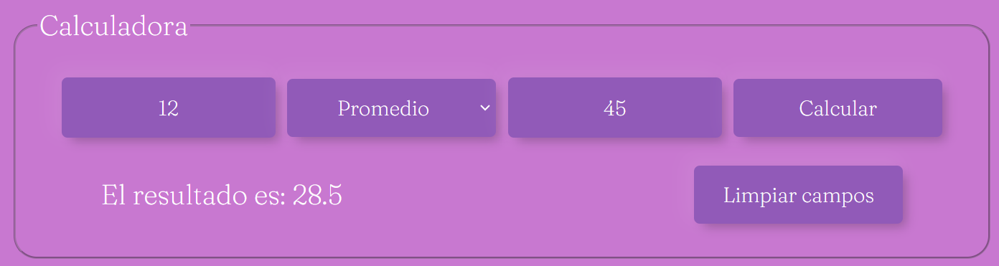


## Despliegue 

_Para poner en marcha la calculadora simple en un entorno de producción, sigue estos pasos:_

1. **Preparación de archivos:**
   Asegúrate de tener todos los archivos necesarios, incluyendo los archivos HTML, CSS y JavaScript de la calculadora.

2. **Subir a un servidor web:**
   Puedes subir los archivos a un servidor web de tu elección. Puedes utilizar servicios de alojamiento web gratuitos o de pago, como GitHub Pages, Netlify, Vercel, entre otros. Si tienes acceso a un servidor propio, también puedes subir los archivos ahí.

3. **Configuración de dominio (opcional):**
   Si deseas asignar un nombre de dominio personalizado a tu calculadora, sigue las instrucciones proporcionadas por el servicio de alojamiento web que estás utilizando. Esto implicará configurar registros DNS y asociar el dominio con la dirección de tu sitio web.

4. **Acceso a la calculadora:**
   Una vez que hayas subido los archivos y configurado el dominio (si es necesario), podrás acceder a tu calculadora simple en línea utilizando la URL correspondiente.

#### Notas adicionales:

- _Asegúrate de que los archivos en el servidor estén actualizados. Si realizas cambios en el código, deberás subir nuevamente los archivos al servidor para que los cambios surtan efecto._
- _Si estás utilizando servicios de alojamiento web como GitHub Pages, revisa la documentación para entender cómo funcionan las actualizaciones automáticas o manuales._


## Construido con 

* [VSCode](https://code.visualstudio.com/) - Editor de código fuente.
* [GitHub](https://github.com/) - Portal para alojar proyectos utilizando el sistema de control de versiones Git.
* [favicon.ico](https://www.favicon.cc/) - Generador de favicon.ico.
* [Boxicons](https://boxicons.com/?query=) - Librería externa de íconos.
* [Comprobador Nu Html](https://validator.w3.org/nu/#cl82c39) - Validador de código HTML creador por la World Wide Web Consortium (W3C).
* [caninclude](https://caninclude.glitch.me/) - Programa creado por CyberLight que nos permite verificar etiquetas contenedoras.
* [flaticon](https://www.flaticon.es/) - Base de datos gratuita de iconos editables.
  

## Bibliografía y Referencias 

Aquí se encuentran las fuentes de información que he utilizado para desarrollar este proyecto:

1. Documentación oficial de MDN Web Docs sobre HTML, CSS y JavaScript.
   - Enlace: [MDN Web Docs](https://developer.mozilla.org/)

2. Guías de HTML, CSS y JavaScript de ManzDev.
   - Enlace: [ManzDev](https://manz.dev/)

3. Documentación oficial de W3Schools sobre HTML, CSS y JavaScript.
   - Enlace: [W3Schools](https://www.w3schools.com/)

4. Guía completa de Flexbox de CSS-Tricks
   - Enlace: [CSS-Tricks](https://css-tricks.com/snippets/css/a-guide-to-flexbox/)

5. Artículo "Qué es un Favicon y para qué sirve" escrito por Montserrat Peñarroya
   - Enlace: [Montse Penarroya](https://www.montsepenarroya.com/que-es-un-favicon-y-para-que-sirve/)

6. Artículo "¿Por qué Javascript es malo en matemáticas?" escrito por Henrique Marques Fernandes.
   - Enlace: [¿Por qué Javascript es malo en matemáticas?](https://marquesfernandes.com/es/tecnologia-es/by-what-the-javascript-and-bad-in-mathmatic/)

7. Artículo "Comprobar Números Javascript" de Manual Web
   - Enlace: [Manual Web](https://www.manualweb.net/javascript/comprobar-numeros-javascript/#:~:text=Comprobar%20si%20es%20un%20n%C3%BAmero%20finito,un%20n%C3%BAmero%20entero%20o%20decimal.)

8. Artículo "CSS: cambiar color de placeholder" escrito por Jorge Maiden 
   - Enlace: [Bufa](https://www.bufa.es/cambiar-color-placeholder/)

9. Foro de ayuda de Stackoverflow "Quitar los bordes cuando este activo el input"
   - Enlace: [stackoverflow](https://es.stackoverflow.com/questions/291434/quitar-los-bordes-cuando-este-activo-el-input)

10. "Primeros pasos con Markdown" de Tutorial RIP.
    - Enlace: [Tutorial RIP](https://riptutorial.com/markdown)

_Estas fuentes me proporcionaron valiosa información y guía para construir esta calculadora. Agradezco a todos los autores y contribuidores por su trabajo._ 


## Autor 


* **Magda Edith Ichida Gomila** - [Magui2608](https://github.com/Magui2608)


## Expresiones de Gratitud 

_Quiero agradecer a mis compañeros de clase práctica, que en alguna que otra ocasión han sido de invaluable ayuda para desarollar este trabajo, así como también la guía constante de nuestro profe de prácticos Juan Yornet._

**Si te gustó mi trabajo:** 
* Comenta a otros sobre este proyecto 
* Da las gracias públicamente 


## Contribuciones 

_Las contribuciones son bienvenidas. Si encuentras algún error o tienes ideas para mejoras, siéntete libre de abrir un problema o enviar una solicitud de extracción._

---
⌨ con ❤️ por [Magui2608](https://github.com/Magui2608) 😊
