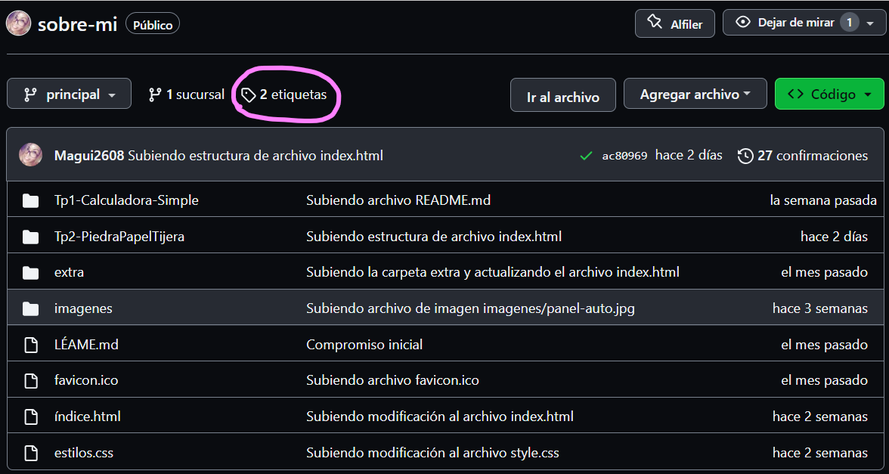
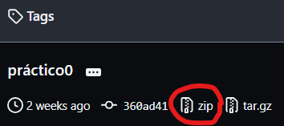

# Piedra 🗿 | Papel 📋 | Tijeras ✂

Trabajo Práctico Nro. 2 de Programación web Front-end dictado por la FAMAF (UNC) - Argentina Programa 4.0.

## Objetivo 🎯

_El objetivo de este práctico es desarrollar un juego web simple utilizando HTML5, CSS3 y JavaScript que permita jugar al famoso juego de "Piedra, Papel o Tijeras" contra la computadora._


## Cómo Jugarlo 💫

_El juego de **"Piedra, Papel o Tijera"** es un juego de manos en el que dos jugadores eligen entre tres opciones: piedra, papel o tijera. Para empezar, debes entender que la mano cerrada simboliza la **piedra**, la mano extendida es el **papel** y dejar extendidos los dedos índice y mayor en forma de V mientras que cerramos los demás, significa la **tijera**._

+ Las reglas son las siguientes:
   - La piedra vence a la tijera.
   - La tijera vencen al papel.
   - El papel vence a la piedra.

El programa que he desarrollado, permite al usuario jugar contra la computadora.   

1. Ingresa tu nombre, según se solicita.
2. Luego, deberás ingresar tu elección a través de cliclear en la imagen de la opción elegida (piedra, papel o tijera).
3. La computadora elegirá una opción de forma aleatoria.
4. El programa determinará el ganador y mostrará el resultado por pantalla.
5. Ganará la ronda quien elija la opción que venza a la otra. Por cada ronda ganada, se sumará un punto a favor del vencedor.
6. Pasada 5 rondas ganará quien tenga más puntos o quien llegue primero a las 3 victorias.

### Pre-requisitos 📄

Antes de comenzar, asegúrate de tener lo siguiente: 

- **Navegador Web:** Asegúrate de tener instalado un navegador web actualizado, como Google Chrome, Mozilla Firefox, Safari, o Microsoft Edge. 

- **Conexión a Internet:** Para acceder a los recursos externos.

- **WinZip:** Para poder descomprimir el archivo. Para ello, dirígete al siguiente enlace:

    + [WinZip](https://www.winzip.com/es/download/winzip//) - _Descarga el programa que permite comprimir y descomprimir archivos._

- **Editor de código:** Si lo que deseas es ver o modificar el código con el que fue desarrollado, deberás descargar un editor de código como Visual Studio Code, Atom, Notepad++, entre otros. Te dejo debajo el programa que utilicé para que puedas descargarlo.

    + [VSCode](https://code.visualstudio.com/) - Editor de código fuente.


## Instalación 🛠

_Sigue estos pasos para obtener y ejecutar el juego en tu máquina:_

1. **Clonar el Repositorio:** Abre tu terminal y navega a la ubicación donde deseas almacenar el juego. Luego, ejecuta el siguiente comando para clonar el repositorio:

```
git clone https://github.com/Magui2608/sobre-mi.git
```
2. **Descargar como Archivo ZIP:** Si prefiere descargar el repositorio como un archivo ZIP en lugar de clonarlo usando Git, sigue estos pasos: 

    + _Ve a la página principal del repositorio en GitHub:_ [https://github.com/Magui2608/sobre-mi](https://github.com/Magui2608/sobre-mi)

    + _Haz clic en "tag", busca el archivo **practico2** y haz clic en zip para descargarlo._
        >Imágenes de referencia
        
        
        >Imágenes de referencia
        
        

    + _Una vez descargado, deberás abrirlo haciendo doble clic sobre él y este se abrirá con el programa WinZip para que lo puedas descomprimir dentro de la carpeta de tu preferencia._


## Ejecutando las pruebas 🔩

_Si deseas realizar pruebas en el juego, sigue estos pasos:_

###Paso 1: 
Asegúrese de tener el repositorio clonado o descargado en su máquina local. Si aún no lo ha hecho, siga las instrucciones de la sección de instalación.

###Paso 2: 
Abre el archivo `index.html` en tu navegador web para cargar el juego. Aquí tienes los pasos para hacerlo:

- Abre el Explorador de Archivos en tu pc.
- Navega a la carpeta donde clonaste el repositorio o descomprimiste el archivo ZIP.
- Busca y haz doble clic en el archivo llamado `index.html`. Esto abre el programa en tu navegador predeterminado.

###Paso 3: 
Una vez que el juego se carga en tu navegador, realiza las siguientes operaciones para verificar su funcionamiento:

- Ingresa tu nombre.


## Construido con 🧱

* [VSCode](https://code.visualstudio.com/) - Editor de código fuente.
* [GitHub](https://github.com/) - Portal para alojar proyectos utilizando el sistema de control de versiones Git.
* [favicon.ico](https://www.favicon.cc/) - Generador de favicon.ico.
* [Boxicons](https://boxicons.com/?query=) - Librería externa de íconos.
* [Comprobador Nu Html](https://validator.w3.org/nu/#cl82c39) - Validador de código HTML creador por la World Wide Web Consortium (W3C).
* [caninclude](https://caninclude.glitch.me/) - Programa creado por CyberLight que nos permite verificar etiquetas contenedoras.
* [flaticon](https://www.flaticon.es/) - Base de datos gratuita de iconos editables.
  

## Bibliografía y Referencias 📚

Aquí se encuentran las fuentes de información que he utilizado para desarrollar este proyecto:

1. Documentación oficial de MDN Web Docs sobre HTML, CSS y JavaScript.
   - Enlace: [MDN Web Docs](https://developer.mozilla.org/)

2. Guías de HTML, CSS y JavaScript de ManzDev.
   - Enlace: [ManzDev](https://manz.dev/)

3. Documentación oficial de W3Schools sobre HTML, CSS y JavaScript.
   - Enlace: [W3Schools](https://www.w3schools.com/)

4. Guía completa de Flexbox de CSS-Tricks
   - Enlace: [CSS-Tricks](https://css-tricks.com/snippets/css/a-guide-to-flexbox/)

5. "Primeros pasos con Markdown" de Tutorial RIP.
    - Enlace: [Tutorial RIP](https://riptutorial.com/markdown)
6. "Una guía completa de Flexbox" de CSS Tricks.
    - Enlace: [CSS Tricks](https://css-tricks.com/snippets/css/a-guide-to-flexbox/)

_Estas fuentes me proporcionaron valiosa información y guía para construir este juego. Agradezco a todos los autores y contribuidores por su trabajo._ 

## Autor 🖋

* **Magda Edith Ichida Gomila** - [Magui2608](https://github.com/Magui2608)


## Expresiones de Gratitud 🙏

_Quiero agradecer a mis compañeros de clase práctica, que en alguna que otra ocasión han sido de invaluable ayuda para desarollar este trabajo, así como también la guía constante de nuestro profe de prácticos Juan Yornet._

**Si te gustó mi trabajo:** 
* Comenta a otros sobre este proyecto 🔊
* Da las gracias públicamente 💞


## Contribuciones 🎊

_Las contribuciones son bienvenidas. Si encuentras algún error o tienes ideas para mejoras, siéntete libre de abrir un problema o enviar una solicitud de extracción._

---
⌨ con ❤️ por [Magui2608](https://github.com/Magui2608) 😊
