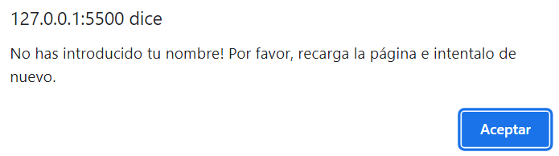
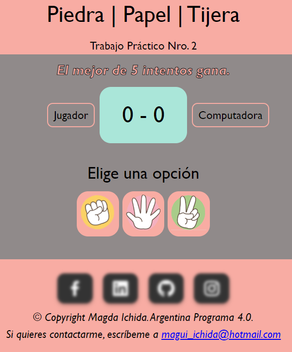
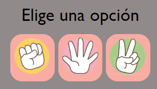
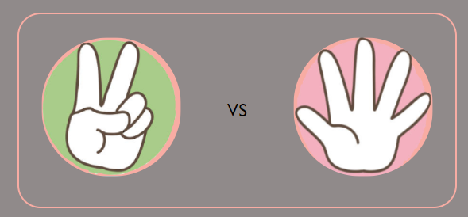
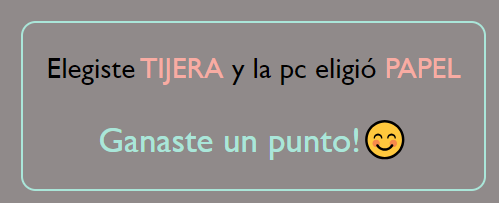
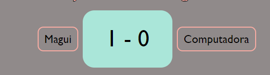
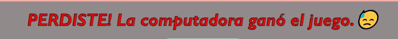
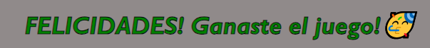
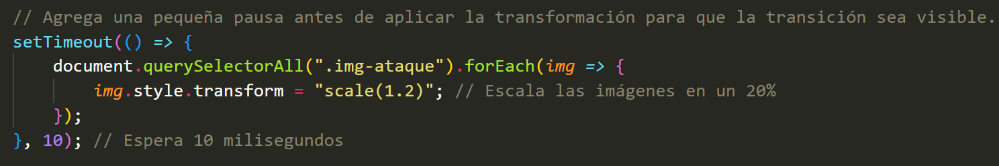

# Piedra 🗿 | Papel 📋 | Tijeras ✂

Trabajo Práctico Nro. 2 de Programación web Front-end dictado por la FAMAF (UNC) - Argentina Programa 4.0.

## Objetivo 🎯

_El objetivo de este práctico es desarrollar un juego web simple utilizando HTML5, CSS3 y JavaScript que permita jugar al famoso juego de "Piedra, Papel o Tijeras" contra la computadora._


## Cómo Jugarlo 💫

_El juego de **"Piedra, Papel o Tijera"** es un juego de manos en el que dos jugadores eligen entre tres opciones: piedra, papel o tijera. Para empezar, debes entender que la mano cerrada simboliza la **piedra**, la mano extendida es el **papel** y dejar extendidos los dedos índice y mayor en forma de V mientras que cerramos los demás, significa la **tijera**._

+ Las reglas son las siguientes:
   - La piedra vence a la tijera.
   - La tijera vencen al papel.
   - El papel vence a la piedra.

El programa que he desarrollado, permite al usuario jugar contra la computadora.   

1. Ingresa tu nombre, según se solicita.
2. Luego, deberás ingresar tu elección a través de cliclear en la imagen de la opción elegida (piedra, papel o tijera).
3. La computadora elegirá una opción de forma aleatoria.
4. El programa determinará el ganador y mostrará el resultado por pantalla.
5. Ganará la ronda quien elija la opción que venza a la otra. Por cada ronda ganada, se sumará un punto a favor del vencedor.
6. Pasada 5 rondas ganará quien tenga más puntos o quien llegue primero a las 3 victorias.

### Pre-requisitos 📄

Antes de comenzar, asegúrate de tener lo siguiente: 

- **Navegador Web:** Asegúrate de tener instalado un navegador web actualizado, como Google Chrome, Mozilla Firefox, Safari, o Microsoft Edge. 

- **Conexión a Internet:** Para acceder a los recursos externos.

- **WinZip:** Para poder descomprimir el archivo. Para ello, dirígete al siguiente enlace:

    + [WinZip](https://www.winzip.com/es/download/winzip//) - _Descarga el programa que permite comprimir y descomprimir archivos._

- **Editor de código:** Si lo que deseas es ver o modificar el código con el que fue desarrollado, deberás descargar un editor de código como Visual Studio Code, Atom, Notepad++, entre otros. Te dejo debajo el programa que utilicé para que puedas descargarlo.

    + [VSCode](https://code.visualstudio.com/) - Editor de código fuente.


## Instalación 🛠

_Sigue estos pasos para obtener y ejecutar el juego en tu máquina:_

1. **Clonar el Repositorio:** Abre tu terminal y navega a la ubicación donde deseas almacenar el juego. Luego, ejecuta el siguiente comando para clonar el repositorio:

```
git clone https://github.com/Magui2608/sobre-mi.git
```
2. **Descargar como Archivo ZIP:** Si prefiere descargar el repositorio como un archivo ZIP en lugar de clonarlo usando Git, sigue estos pasos: 

    + _Ve a la página principal del repositorio en GitHub:_ [https://github.com/Magui2608/sobre-mi](https://github.com/Magui2608/sobre-mi)

    + _Haz clic en "tag", busca el archivo **practico2** y haz clic en zip para descargarlo._
        >Imágenes de referencia
        

        
        >Imágenes de referencia
        
        

    + _Una vez descargado, deberás abrirlo haciendo doble clic sobre él y este se abrirá con el programa WinZip para que lo puedas descomprimir dentro de la carpeta de tu preferencia._


## Ejecutando las pruebas 🔩

_Si deseas realizar pruebas en el juego, sigue estos pasos:_

###Paso 1: 
Asegúrese de tener el repositorio clonado o descargado en su máquina local. Si aún no lo ha hecho, siga las instrucciones de la sección de instalación.

###Paso 2: 
Abre el archivo `index.html` en tu navegador web para cargar el juego. Aquí tienes los pasos para hacerlo:

- Abre el Explorador de Archivos en tu pc.
- Navega a la carpeta donde clonaste el repositorio o descomprimiste el archivo ZIP.
- Busca y haz doble clic en el archivo llamado `index.html`. Esto abre el programa en tu navegador predeterminado.

###Paso 3: 
Una vez que el juego se carga en tu navegador, realiza las siguientes operaciones para verificar su funcionamiento:

- Ingresa tu nombre.


- Si se intenta ingresar números o no ingresar nada, se mostrará este texto:



- Pantalla de Inicio del Juego



- Elige una opción entre piedra, papel, tijera



- Se mostrará el campo de batalla con la opción elegida por cada jugador



-Debajo verás un mensaje que indica la elección de cada participante y quien gana la ronda o si ésta es un empate.



-En la parte superior, verás el marcador de puntos, en donde se computan las rondas ganadas por cada participante.



-Al finalizar las 5 rondas u obtener 3 victorias, el resultado del ganador del juego se mostrará en la parte superior de la página.





### Transiciones Suaves

_Agregué transiciones suaves a las animaciones del juego para mejorar la experiencia del usuario. Después de mostrar el resultado, las imágenes vuelven a su escala original con una transición de 10 milisegundos. Esto hace que el juego se sienta más fluido y agradable de jugar._



### Características Destacadas

- Juego contra la computadora.
- Marcador de puntos para jugador y computadora.
- Reglas claras y simples.

### Personalización

_Puedes personalizar la apariencia del juego modificando el archivo de estilos CSS. Las clases y estilos están organizados de manera que puedas ajustar los colores, fuentes y diseños según tus preferencias._

### Ejemplo de Código: Validar nombre del jugador

_En esta sección del código, verifico si el nombre del jugador está en blanco o contiene solo espacios en blanco o si ingresa números. Luego, convierte la primera letra del nombre del jugador en mayúscula y convierte el resto a minúsculas. Por último, asigna el nombre del jugador al elemento HTML correspondiente._

```
if ((jugador === "") || !isNaN(jugador)) {
    alert("No has introducido tu nombre! Por favor, recarga la página e intentalo de nuevo.");
} else {
    jugador = jugador.charAt(0).toUpperCase() + jugador.slice(1).toLowerCase();
    let nombre = document.querySelector(".nombre-jugador");
    nombre.textContent = jugador;
}
```
### Ejemplo de Código: Iniciar un Turno

_En esta sección del código, se muestra cómo se inicia un turno del juego cuando el jugador elige una opción._

```
// Función para iniciar un turno
   function iniciarTurno() {
       campoBatalla.classList.remove('disabled');
       jugadaComputadora();
       determinarTurnoGanador();

    // Modifica el contenido HTML de los contenedores para mostrar las imágenes
       document.getElementById("ataque-jugador").innerHTML = ``;
       document.getElementById("ataque-pc").innerHTML = ``;

       mensaje.classList.remove('disabled');
       eleccionJugador.innerHTML = opcionJugador.toUpperCase();
       eleccionPc.innerHTML = opcionComputadora.toUpperCase();
       reiniciar.classList.remove('disabled');
       reiniciar.addEventListener('click', reiniciarJuego);
   }
```

### Ejemplo de Código: Capturar la elección del jugador

_En esta sección del código, agrego un evento de clic a cada botón de opción del juego, para capturar la elección del jugador._

```
opcionElegida.forEach(btn => {
    btn.addEventListener("click", function (e) {
        opcionJugador = e.currentTarget.id;
        iniciarTurno();
    });
})
```

### Ejemplo de Código: Jugada de la computadora

_En esta sección del código, genero un numero aleatorio del 0 al 2 para poder asignarle a cada uno los valores de piedra, papel o tijera y determinar así la jugada aleatoria del la pc._

```
// Genera un número aleatorio entre 0 y 2 para representar la elección de la computadora.
function numeroAleatorio() {
    let numeroAleatorio = Math.floor(Math.random() * 3);
    return numeroAleatorio;
}

// Determina la jugada de la computadora a partir del número aleatorio generado.
function jugadaComputadora() {
    opcionComputadora = numeroAleatorio();
    if (opcionComputadora === 0) {
        opcionComputadora = "piedra";
    } else if (opcionComputadora === 1) {
        opcionComputadora = "papel";
    } else {
        opcionComputadora = "tijera";
    }
    return opcionComputadora;
}
```
### Ejemplo de Código: Ganador de la ronda

_En esta sección del código, determino quien gana cada ronda o si hay un caso de empate._

```
// Determina quien gana en cada turno o si hay empate y actualiza los marcadores.
function determinarTurnoGanador() {
    if ((opcionComputadora === "piedra" && opcionJugador === "tijera") ||
        (opcionComputadora === "papel" && opcionJugador === "piedra") ||
        (opcionComputadora === "tijera" && opcionJugador === "papel")) {
        ganaPc();
    } else if ((opcionJugador === "piedra" && opcionComputadora === "tijera") ||
        (opcionJugador === "papel" && opcionComputadora === "piedra") ||
        (opcionJugador === "tijera" && opcionComputadora === "papel")) {
        ganaJugador();
    } else {
        empate();
    }
    determinarGanador();
}
```
### Ejemplo de Código: Asignación de puntos en el marcador

_En esta sección del código, determino cómo se asignan los puntos ganados a cada jugador o si es un empate, que no sume puntos a ninguno. También notifica si esa ronda fue ganada o empatada y por quién._

```
// Función para cuando el jugador gana un punto en un turno.
function ganaJugador() {
    puntosJugador++;
    marcadorPuntosJugador.innerHTML = puntosJugador;
    ganaPunto.innerHTML = "Ganaste un punto!😊";
}

// Función para cuando la computadora gana un punto en un turno.
function ganaPc() {
    puntosPc++;
    marcadorPuntosPc.innerHTML = puntosPc;
    ganaPunto.innerHTML = "La computadora ganó un punto!😕";
}

// Función para manejar un empate en un turno.
function empate() {
    ganaPunto.innerHTML = "Empate!😮";
}
```

### Ejemplo de Código: Determinar ganador

_En esta sección del código, se determina quién es el ganador de 5 intentos o aquel que alcance primero 3 victorias._

```
/* Cuenta las rondas hasta un máximo de 5 intentos y verifica si uno de los jugadores ha 
alcanzado 3 victorias. Luego, muestra el mensaje correspondiente y desactiva las opciones de juego. */
function determinarGanador() {
    let totalRondas = 0;
    let maxRondas = 5; // el mejor de 5 intentos
    while (totalRondas < maxRondas) {

        if (puntosJugador === 3) {
            instrucciones.innerHTML = "FELICIDADES! Ganaste el juego!🥳";
            instrucciones.style.color = "green"; // Cambia el color del texto a verde
            instrucciones.style.fontSize = "24px"; // Cambia el tamaño de fuente


            opcionesJuego.classList.add('disabled');
            campoBatalla.classList.add('disabled');
            subtitulo.classList.add('disabled');
            break;
        }
        if (puntosPc === 3) {
            instrucciones.innerHTML = "PERDISTE! La computadora ganó el juego.😓";
            instrucciones.style.color = "red"; // Cambia el color del texto a verde
            instrucciones.style.fontSize = "24px"; // Cambia el tamaño de fuente

            opcionesJuego.classList.add('disabled');
            campoBatalla.classList.add('disabled');
            subtitulo.classList.add('disabled');
            break;
        }
        totalRondas++;
    }
}
```

### Ejemplo de Código: Botón de reinicio

_En esta sección del código, establezco cómo funciona el botón que resetea el juego._ 

```
/* Resetea los datos del tablero de puntos a 0 y la cantidad de rondas. Deshabilita en botón de 
reinicio y mensajes y habilita el de las opciones nuevamente. */
function reiniciarJuego() {
    reiniciar.classList.add('disabled');
    opcionesJuego.classList.remove('disabled');
    mensaje.classList.add('disabled');
    campoBatalla.classList.add('disabled');
    restaurarEstiloInstrucciones();
    puntosJugador = 0;
    puntosPc = 0;
    totalRondas = 0;
    marcadorPuntosJugador.innerHTML = puntosJugador;
    marcadorPuntosPc.innerHTML = puntosPc;
    instrucciones.innerHTML = "El mejor de <strong>5 intentos</strong> gana.";

    // Elimina las imágenes del jugador y la computadora del campo de batalla
    imgJugador.parentNode.removeChild(imgJugador);
    imgPc.parentNode.removeChild(imgPc);

}
```

## Construido con 🧱

* [VSCode](https://code.visualstudio.com/) - Editor de código fuente.
* [GitHub](https://github.com/) - Portal para alojar proyectos utilizando el sistema de control de versiones Git.
* [favicon.ico](https://www.favicon.cc/) - Generador de favicon.ico.
* [Boxicons](https://boxicons.com/?query=) - Librería externa de íconos.
* [Comprobador Nu Html](https://validator.w3.org/nu/#cl82c39) - Validador de código HTML creador por la World Wide Web Consortium (W3C).
* [caninclude](https://caninclude.glitch.me/) - Programa creado por CyberLight que nos permite verificar etiquetas contenedoras.
* [flaticon](https://www.flaticon.es/) - Base de datos gratuita de iconos editables.
  

## Bibliografía y Referencias 📚

Aquí se encuentran las fuentes de información que he utilizado para desarrollar este proyecto:

1. Documentación oficial de MDN Web Docs sobre HTML, CSS y JavaScript.
   - Enlace: [MDN Web Docs](https://developer.mozilla.org/)

2. Guías de HTML, CSS y JavaScript de ManzDev.
   - Enlace: [ManzDev](https://manz.dev/)

3. Documentación oficial de W3Schools sobre HTML, CSS y JavaScript.
   - Enlace: [W3Schools](https://www.w3schools.com/)

4. Guía completa de Flexbox de CSS-Tricks
   - Enlace: [CSS-Tricks](https://css-tricks.com/snippets/css/a-guide-to-flexbox/)

5. "Primeros pasos con Markdown" de Tutorial RIP.
    - Enlace: [Tutorial RIP](https://riptutorial.com/markdown)
6. "Una guía completa de Flexbox" de CSS Tricks.
    - Enlace: [CSS Tricks](https://css-tricks.com/snippets/css/a-guide-to-flexbox/)

_Estas fuentes me proporcionaron valiosa información y guía para construir este juego. Agradezco a todos los autores y contribuidores por su trabajo._ 

## Autor 🖋

* **Magda Edith Ichida Gomila** - [Magui2608](https://github.com/Magui2608)


## Expresiones de Gratitud 🙏

_Quiero agradecer a mis compañeros de clase práctica, que en alguna que otra ocasión han sido de invaluable ayuda para desarollar este trabajo, así como también la guía constante de nuestro profe de prácticos Juan Yornet._

**Si te gustó mi trabajo:** 
* Comenta a otros sobre este proyecto 🔊
* Da las gracias públicamente 💞


## Contribuciones 🎊

_Las contribuciones son bienvenidas. Si encuentras algún error o tienes ideas para mejoras, siéntete libre de abrir un problema o enviar una solicitud de extracción._

---
⌨ con ❤️ por [Magui2608](https://github.com/Magui2608) 😊
